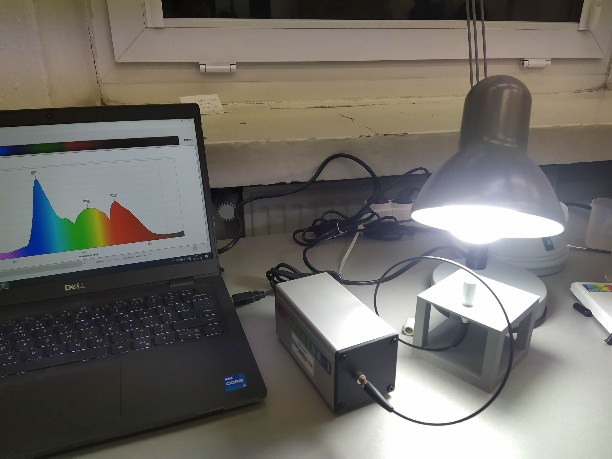
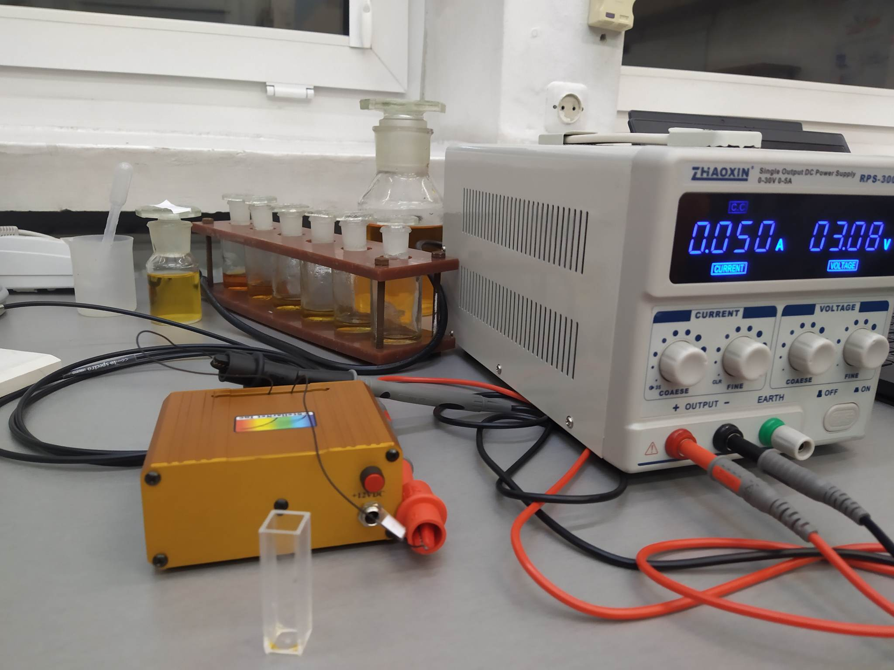
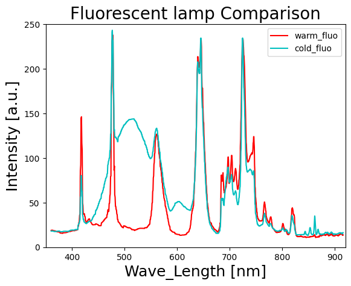
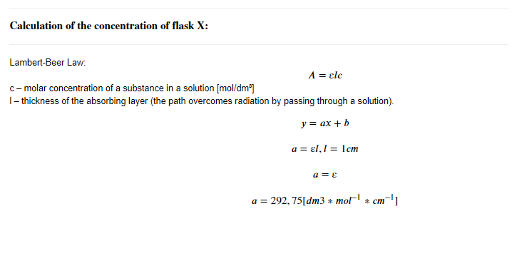

# Data-analysis--Sensor-technology

This repository is a collection of analyzes of various sensors tested by me as part of laboratories at the Wrocław University of Technology

## Sensors
* [spectrophotometric](#spectrophotometric)
* [humidity](#humidity)

## spectrophotometric

<table><tr>
<td>

</td>    
</tr></table>

Spectroscopy
is one of the oldest techniques used in analytical chemistry, but it is also used
for lighting quality control. The exercise consists in learning the techniques of chemical analysis and examining the emission spectrum commonly used
sources of white light and determining, among others, which of them best suits the human eye.

## humidity

<table><tr>
<td>

</td>    
</tr></table>

Humidity sensing is a fundamental technique employed in various applications, including environmental monitoring, industrial processes, and comfort control systems. This exercise focuses on understanding the principles of humidity analysis and exploring different humidity sensor technologies. By examining their performance and response characteristics, we aim to identify the most suitable sensor for accurately measuring and monitoring moisture levels in the surrounding environment.
